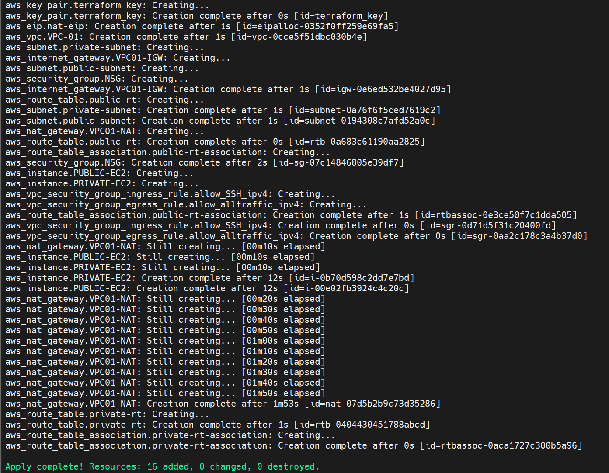
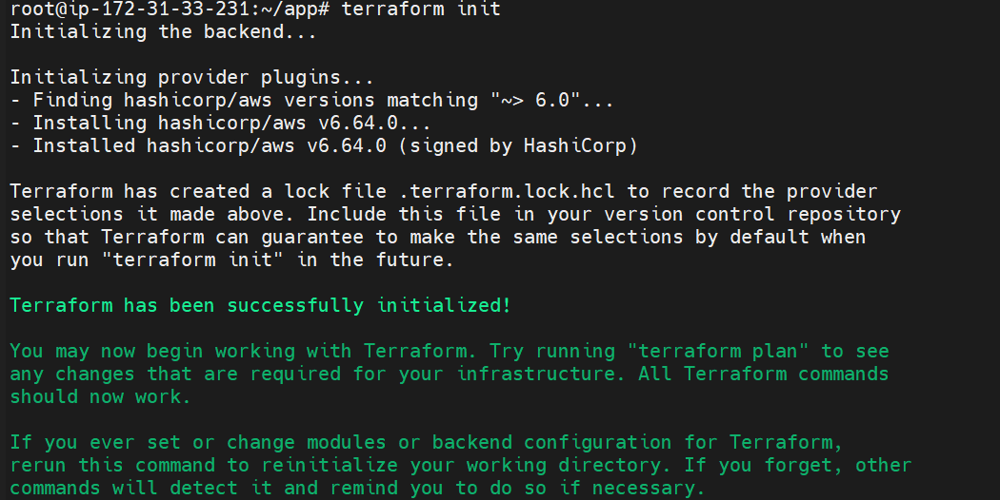
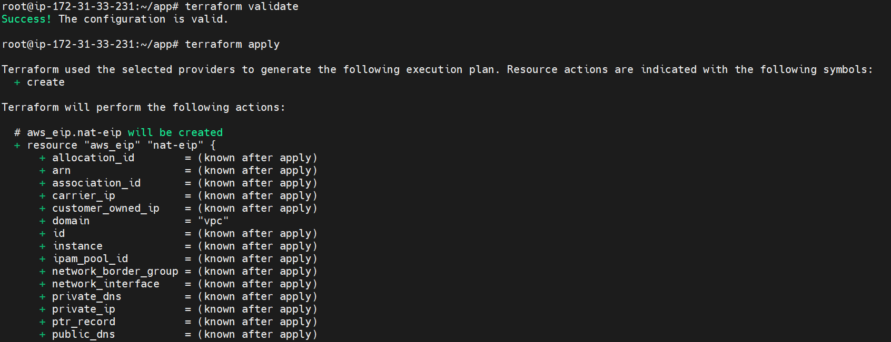
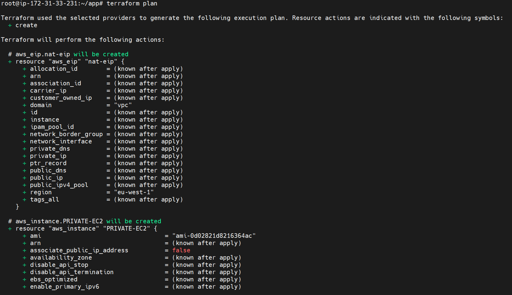
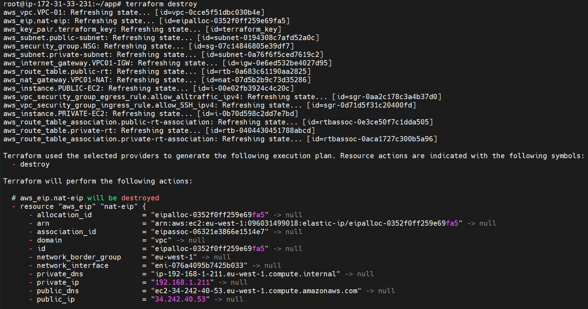
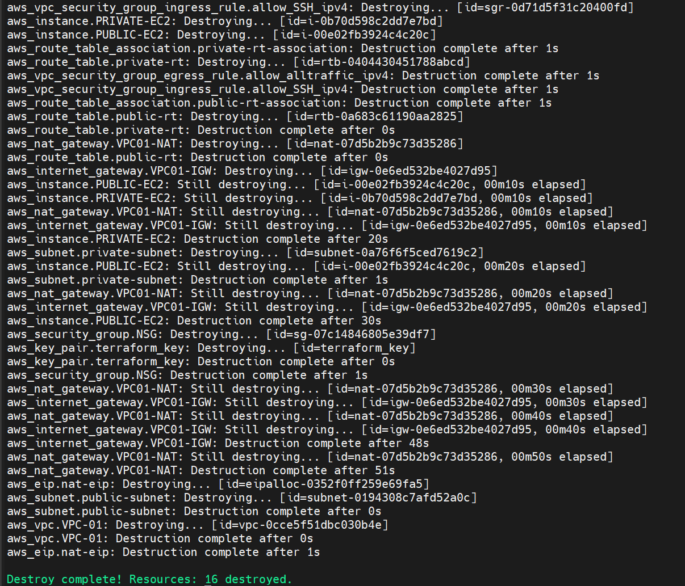

AWS VPC - Public & Private Subnet Architecture with Terraform

Project Overview

This project demonstrates how to build an AWS Virtual Private Cloud (VPC) infrastructure using Terraform.

The infrastructure includes:

- Custom VPC
- Public Subnet
- Private Subnet
- Internet Gateway
- NAT Gateway
- Elastic IP
- Public Route Table
- Private Route Table
- Security Group
- Public EC2 Instance
- Private EC2 Instance
- AWS Key Pair

The goal is to:

- Allow the Public EC2 instance to access the Internet through the Internet Gateway.
- Allow the Private EC2 instance to access the Internet through the NAT Gateway.
- Keep the Private EC2 instance without a public IP address.
- Automate the AWS infrastructure using Terraform.

Architecture

The Terraform configuration creates a VPC containing Public and Private Subnets. The Public Subnet uses an Internet Gateway for Internet connectivity, while the Private Subnet uses a NAT Gateway for outbound Internet access.

Services Used

- Amazon VPC
- Amazon EC2
- Internet Gateway
- NAT Gateway
- Elastic IP
- Route Tables
- Security Groups
- AWS Key Pair
- Terraform
- MobaXterm

Network Details

| Resource | CIDR / Configuration |
|----------|----------------------|
| VPC | 192.168.0.0/16 |
| Public Subnet | 192.168.1.0/24 |
| Private Subnet | 192.168.2.0/24 |

Terraform Execution Steps

Step 1 - Initialize Terraform

Initialized the Terraform working directory and downloaded the required AWS provider plugins.

terraform init

Step 2 - Validate Terraform Configuration

Validated the Terraform configuration to check for syntax and configuration errors.

terraform validate

Step 3 - Review Terraform Execution Plan

Created a Terraform execution plan to preview the AWS infrastructure that will be created.

terraform plan

Step 4 - Apply Terraform Configuration

Applied the Terraform configuration to provision the AWS infrastructure.

terraform apply

AWS Infrastructure

Step 5 - Create VPC

Created a custom AWS VPC with the CIDR block:

192.168.0.0/16

The VPC acts as the main network for the Public and Private Subnets.

Step 6 - Create Public Subnet

Created the Public Subnet with the CIDR block:

192.168.1.0/24

The Public EC2 instance is deployed inside this subnet.

The Public Subnet uses the Internet Gateway for Internet connectivity.

Step 7 - Create Private Subnet

Created the Private Subnet with the CIDR block:

192.168.2.0/24

The Private EC2 instance is deployed inside this subnet without a public IP address.

The Private Subnet uses the NAT Gateway for outbound Internet connectivity.

Step 8 - Create Internet Gateway

Created and attached an Internet Gateway to the VPC.

The Internet Gateway provides Internet connectivity for resources in the Public Subnet.

Step 9 - Configure Public Route Table

Configured a Public Route Table and associated it with the Public Subnet.

| Destination | Target |
|------------|---------|
| 192.168.0.0/16 | local |
| 0.0.0.0/0 | Internet Gateway |

The default route sends Internet-bound traffic from the Public Subnet to the Internet Gateway.

Step 10 - Allocate Elastic IP

Allocated an Elastic IP address for the NAT Gateway.

The Elastic IP provides a stable public IPv4 address for the NAT Gateway.

Step 11 - Create NAT Gateway

Created the NAT Gateway inside the Public Subnet.

The NAT Gateway allows resources in the Private Subnet to initiate outbound Internet connections without having a public IP address.

Step 12 - Configure Private Route Table

Configured a Private Route Table and associated it with the Private Subnet.

| Destination | Target |
|------------|---------|
| 192.168.0.0/16 | local |
| 0.0.0.0/0 | NAT Gateway |

The default route sends Internet-bound traffic from the Private Subnet to the NAT Gateway.

Step 13 - Create Security Group

Created a Security Group for the EC2 instances.

The Security Group allows SSH inbound traffic and outbound traffic.

Step 14 - Create AWS Key Pair

Created an AWS Key Pair using Terraform for EC2 SSH authentication.

Step 15 - Launch Public EC2 Instance

Launched a Public EC2 instance inside the Public Subnet.

The Public EC2 instance is configured with a public IP address and can communicate with the Internet through the Internet Gateway.

Step 16 - Launch Private EC2 Instance

Launched a Private EC2 instance inside the Private Subnet.

The Private EC2 instance does not have a public IP address and uses the NAT Gateway for outbound Internet connectivity.

Connectivity

The Terraform infrastructure was successfully provisioned on AWS.

The Public EC2 instance can communicate with the Internet through the Internet Gateway.

The Private EC2 instance can access the Internet through the NAT Gateway without having a public IP address.

Terraform Cleanup

Step 17 - Review Terraform Destroy Plan

Reviewed the Terraform destroy plan to verify the AWS resources that will be removed.

terraform plan -destroy

Step 18 - Destroy Terraform Infrastructure

Destroyed the AWS infrastructure created by Terraform.

terraform destroy

Learning Outcomes

- Created an AWS VPC using Terraform.
- Configured Public and Private Subnets.
- Attached an Internet Gateway to the VPC.
- Created a NAT Gateway with an Elastic IP.
- Configured Public and Private Route Tables.
- Configured Security Groups using Terraform.
- Created an AWS Key Pair using Terraform.
- Launched Public and Private EC2 instances.
- Configured outbound Internet access for the Private Subnet through the NAT Gateway.
- Used Terraform to automate AWS infrastructure deployment.
- Used Terraform plan to preview infrastructure changes.
- Used Terraform apply to provision AWS resources.
- Used Terraform destroy to clean up AWS resources.

Author

ADITYA MANIVANNAN

AWS Cloud | DevOps Engineer
